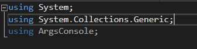

# ConsoleArgsParser
## CodeKatas
Development tendency of apps course group project - CodeKatas, a library that helps you parse boolean flags from command line.

## Getting Started

These instructions will get you a copy of the project up and running on your local machine for development and testing purposes. See deployment for notes on how to deploy the project on a live system.

### Prerequisites

Visual Studio 2017 or newer

Nuget Package manager 

NetCore extension installed

### Installing

(If retrieving package from nuget.org in Nuget Package Manager)
  1.Create/open a .NET Core project

  2.Open Nuget Package Manager for the solution

  3.Select 'nuget.org' as origin

  4.Search for 'ConsoleArgsParser'

  5.Install the newest version on to the solution.

(If manually downloading the nuget and then installing in Visual Studio 2017+)
  1.Create/open a .NET Core project

  2.Open Nuget Package Manager for the solution

  3.Open the setting for the nugets origin.

  4.Add a new origin

  5.Name the new origin

  6.Select the path for the origin (the path of the nuget package)

  7.Click 'OK'

  8.Select the new origin and look up for 'ConsoleArgsParser'

  9.Install the nuget into the solution

## Implemantation examples
**Using:**

Use the namespace ArgsConsole

**Long Format:**

**Short Format:**

**Combined Format:**

## Running the tests

NUnit 
NUnit 3 Test Adapter (Required for running unit tests in .NetCore)
Microsoft.NET.Test.sdk (Development tools for running unit tests in .NetCore)

### Break down into end to end tests

No tests ready yet 

### And coding style tests

No explanation avaliable 

## Built With

* Powered by C# .NetCore 2.1

## Contributing

Please read [CONTRIBUTING.md]

## Authors

* **Development tendency of apps course students 

See also the list of [contributors](https://github.com/Evalir/ConsoleArgsParser/graphs/contributors) who participated in this project.

## License

This project is licensed under the MIT License - see the [LICENSE.md](LICENSE.md) file for details

## Acknowledgments

* This project was inspired by the Args Kata. You can find more information at http://codingdojo.org/kata/Args/

## Blog Post

[We wrote this blog post](https://medium.com/@ergerica76/intro-to-args-635d8a5f9ade?postPublishedType=initial) to introduce the tool. Check it out!
